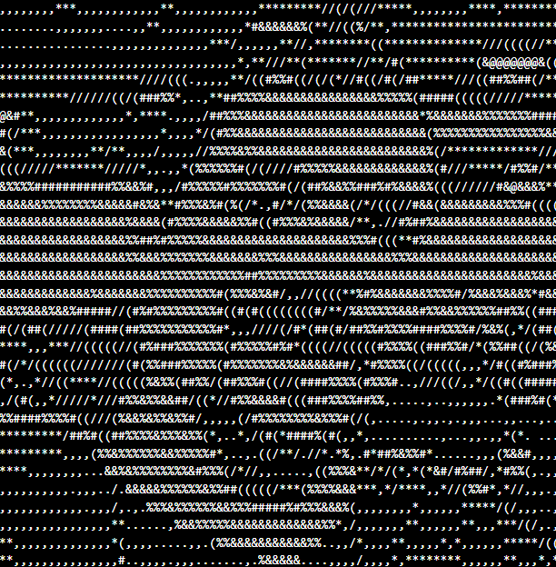

# 💫 About Me:
Atualmente estudando Elixir, Scala, Python, Rust

## 🌐 Socials:
  

# 💻 Tech Stack:
          
# 📊 GitHub Stats:
 
 

## 🏆 GitHub Trophies

### 🔝 Top Contributed Repo

---

<!-- Proudly created with GPRM ( https://gprm.itsvg.in ) -->
